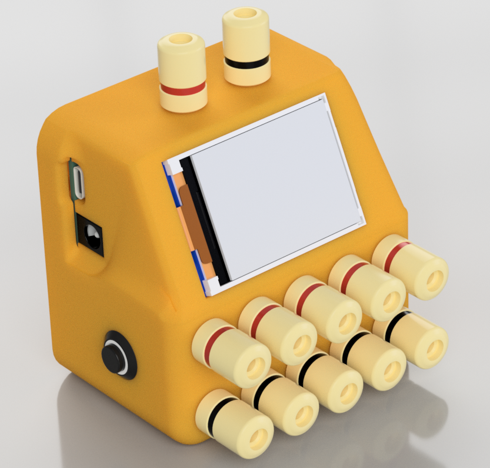
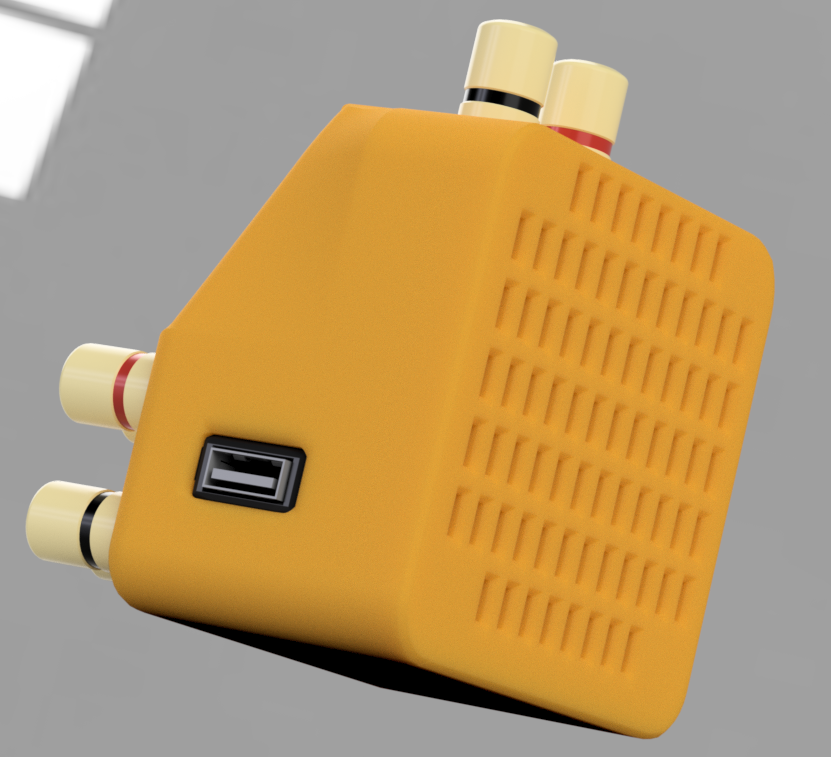
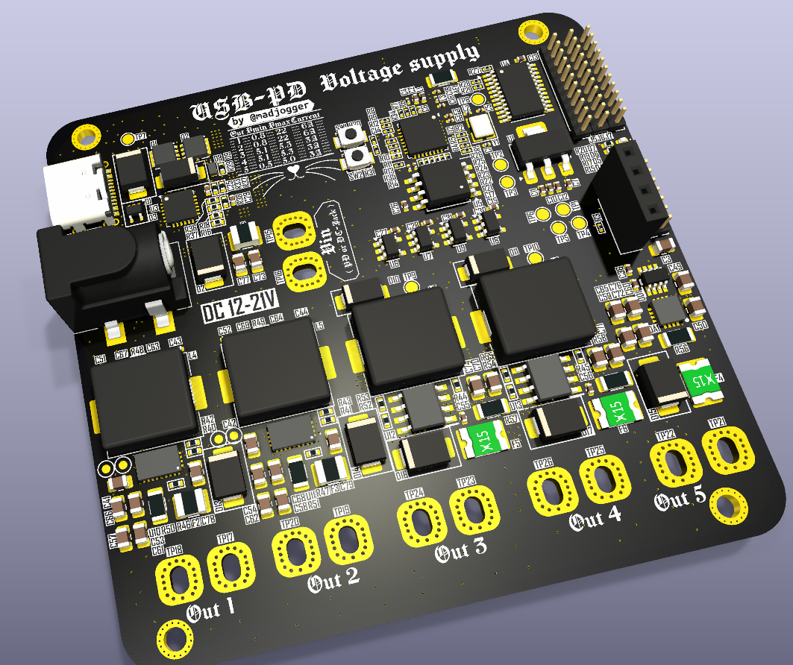
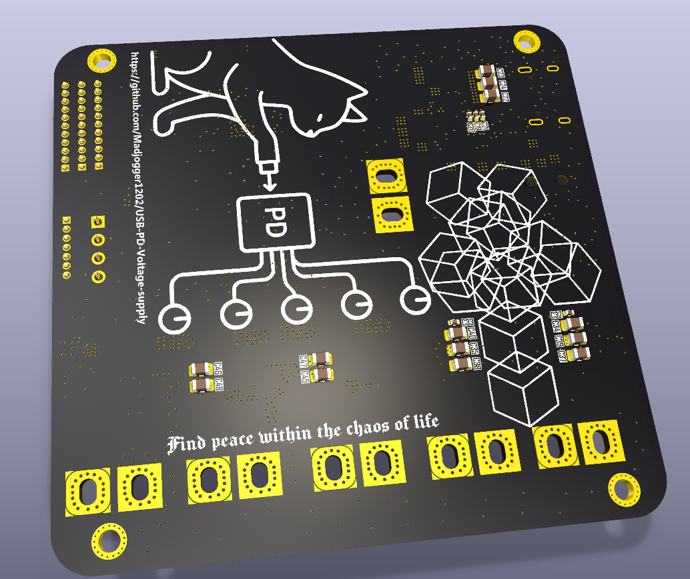
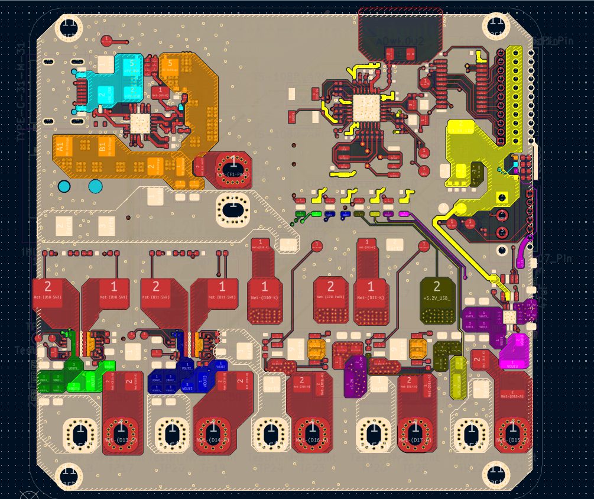
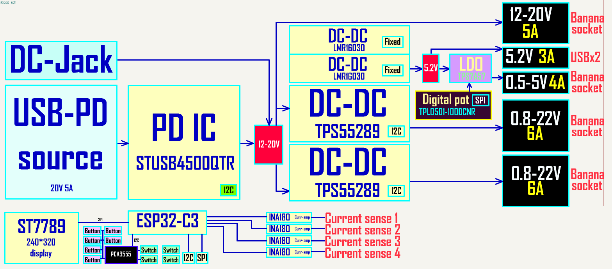

# USB-PD Voltage supply

<table align="center">
  <tr>
    <td>
      
    </td> 
    <td>
      
    </td>
  </tr>
</table>

# Universal Programmable Power Supply Module

A compact, network-enabled power solution designed for debugging modern semiconductor components (e.g., PCIe switches, ASICs, and multi-voltage SoCs). Replaces traditional bench power supplies with a single integrated unit featuring precise voltage control, remote accessibility, and modular expandability.

---

> [!IMPORTANT]
> Project wasn't produced and tested yet.

## Key Features

- **Dual Adjustable DC-DC Outputs**  
  0.8–22 V, 6 A per channel (TPS55289RYQR controllers)  
- **Dual Fixed 5 V Outputs**  
  3 A each (LMR16030PDDAR), one for system logic, one for LDO input  
- **Low-Noise LDO Output**  
  0.5–5 V, 3 A (TPS7A5701RTER with TPL0501-100DCNR digital potentiometer)  
- **Universal Input**  
  Accepts 5–20 V via USB-C Power Delivery (STUSB4500QTR) or barrel jack (max 21 V input)  
- **Network Control**  
  ESP32-C3-based management with secure Wi-Fi/BLE, web interface, and Telegram bot  
- **Precision Monitoring**  
  ±1% current sensing via INA180A2 and ESP32-C3 ADC  
- **Expandable I/O**  
  Integrated GPIO expander for external modules or physical control buttons  
- **PCB Stackup**  
  4-layer board designed for stable power distribution, reduced noise, and improved thermal performance. Layers include dedicated power and ground planes for enhanced signal integrity. 
---

## Technical Specifications

| **Parameter**         | **Details**                                                                 |
|------------------------|-----------------------------------------------------------------------------|
| **Input**              | USB-C PD (20 V/5 A) or 5.5×2.5 mm barrel jack (5–20 V)                      |
| **Adjustable Rails**   | 2× 0.8–22 V / 6 A (DC-DC), 1× 0.5–5 V / 3 A (LDO)                           |
| **Fixed Rails**        | 2× 5 V / 3 A (DC-DC)                                                        |
| **Control Interface**  | ESP32-C3 (Wi-Fi 4, BLE 5), REST API, web UI, Telegram bot                   |
| **Display**            | 2.0" ST7789 (320×240) TFT with real-time voltage/current monitoring         |
| **Current Sensing**    | INA180A2 amplifier with 12-bit ADC resolution                               |
| **Safety Limits**      | Input voltage ≤ 21 V; overcurrent/overvoltage protection per channel        |

---

## PCB

  
  &nbsp;&nbsp;&nbsp;&nbsp;
  
  &nbsp;&nbsp;&nbsp;&nbsp;
  

## Functional diagram

## Standard Configuration

- 6× banana jack terminal pairs 
- 2.0" ST7789 color display (320×240 resolution)  
- USB-A port for peripheral connectivity  
- 12 mm illuminated push-button (power control)    

---

## Development Ecosystem

- **Schematic & PCB Design**: KiCad 9.0 (4-layer stackup)  
- **3D Modeling**: Fusion 360 
- **Firmware**: PlatformIO (Arduino)  

---

## Use Cases

- General-purpose bench power supply
- PCIe switch and high-speed interface debugging  
- Multi-rail ASIC/FPGA prototyping  
- Low-noise analog/digital mixed-signal validation  
- Automated test environments requiring remote power cycling  

---

## Documentation

  - [Schematics](USB-PD-Voltage-supply.pdf)  
  - [Interactive HTML BOM](BOM/USB-PD-Voltage-supply-Interactive-BOM.html)  
  - [3D model with case](3D/USB-PD-Voltage-supply-with-case.step)  
  - Code for PlatformIO coming soon

> **Note**: Input voltage must not exceed 21 V. Always verify load requirements before operation.
